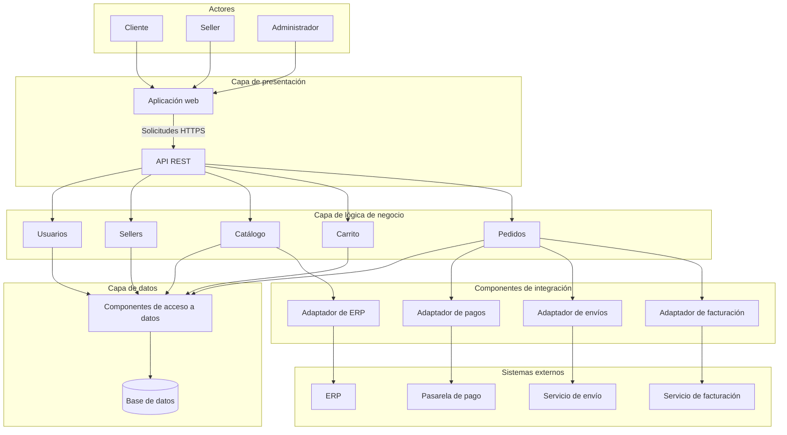

# Arquitectura inicial del sistema

## 1. Propuesta

El marketplace se organiza en tres capas: presentación, lógica de
negocio y datos. Cada capa tiene responsabilidades específicas.

La propuesta inicial utiliza un backend organizado en módulos.
Estos módulos forman parte de una misma aplicación; no se plantea
que cada uno sea un microservicio.

## 2. Responsabilidades por capa

| Capa | Elementos | Responsabilidad |
|---|---|---|
| Presentación | Aplicación web y API REST | Mostrar información, recibir acciones del usuario y dirigir las solicitudes hacia la lógica de negocio. |
| Lógica de negocio | Usuarios, Sellers, Catálogo, Carrito y Pedidos | Aplicar reglas, comprobar permisos y coordinar las operaciones del marketplace. |
| Datos | Componentes de acceso a datos y base de datos | Guardar y consultar usuarios, vendedores, productos, carritos, pedidos y referencias de pagos, comprobantes y envíos. |

La API REST se ejecutará en el backend. Se ubica en presentación
porque actúa como interfaz de entrada al sistema.

## 3. Módulos de negocio

| Módulo | Responsabilidades principales |
|---|---|
| Usuarios | Gestionar cuentas, autenticación, roles y permisos de acceso. |
| Sellers | Administrar vendedores, su estado y la consulta de sus ventas. |
| Catálogo | Gestionar productos, búsquedas y disponibilidad; coordinar la consulta de información del ERP. |
| Carrito | Gestionar los productos seleccionados, sus cantidades y el cálculo de importes. |
| Pedidos | Validar y registrar compras, conservar su detalle y coordinar pagos, facturación y envíos. |

La autorización se aplica en cada operación protegida. No basta
con ocultar botones en la aplicación web.

## 4. Diagrama de arquitectura

Las flechas representan la dirección principal de las solicitudes
o del uso de un componente. Las respuestas se omiten para facilitar
la lectura.

Los componentes de integración son apoyo técnico del backend,
no una cuarta capa de negocio ni servicios independientes.
Separan los detalles de comunicación con cada proveedor.

Las notificaciones de proveedores externos, cuando existan, ingresarán
por endpoints de la API REST, se verificarán mediante el componente
de integración correspondiente y se enviarán a la lógica de negocio.

## 5. Relaciones y dependencias

- Los actores interactúan con la aplicación web.
- La aplicación web solicita operaciones mediante la API REST.
- La API REST delega las operaciones a los módulos de negocio.
- La lógica de negocio utiliza los componentes de acceso a datos.
- La aplicación web no accede directamente a la base de datos.
- Carrito consulta al Catálogo para validar productos y disponibilidad.
- Pedidos utiliza la información del Carrito y valida la disponibilidad
  con Catálogo antes de confirmar una compra.
- Sellers consulta a Pedidos la información de ventas correspondiente
  al vendedor autenticado.
- Pedidos coordina pagos, facturación y envíos mediante los adaptadores.
- Catálogo consulta el ERP mediante su adaptador.

Las relaciones entre módulos se describen aquí para evitar
sobrecargar el diagrama.

## 6. Ejemplo de funcionamiento: realizar una compra

1. El cliente inicia sesión y consulta productos desde la web.
2. La API REST dirige las consultas al módulo Catálogo.
3. El cliente agrega productos al Carrito y selecciona cantidades.
4. Al confirmar la compra, Pedidos verifica el cliente, la dirección,
   los precios y la disponibilidad.
5. El sistema registra el pedido con el pago pendiente.
6. Pedidos solicita el procesamiento del pago mediante el adaptador
   de la pasarela.
7. Cuando se recibe una confirmación válida, el sistema actualiza
   el estado del pago sin duplicar el procesamiento.
8. Si el pago fue aprobado, se solicita el comprobante al servicio
   de facturación.
9. Cuando los productos están preparados y el pago está aprobado,
   se solicita la gestión del envío.
10. El cliente consulta el pedido, su comprobante y el avance
    de la entrega desde la aplicación web.

Si el pago es rechazado, el pedido no se considera pagado ni se
autoriza su despacho.

Un error de facturación o envío se registra como una operación
pendiente de atención, sin borrar la confirmación del pago.

## 7. Justificación de la propuesta

| Decisión | Motivo | Drivers relacionados |
|---|---|---|
| Separar el sistema en tres capas y módulos | Facilitar cambios y mantener responsabilidades claras. | DA06 |
| Utilizar una API REST | Definir la comunicación entre la aplicación web y el backend. | DA05 |
| Aplicar autenticación y autorización en el backend | Proteger las operaciones y los datos de clientes y vendedores. | DA03, DA10 |
| Incorporar adaptadores para servicios externos | Separar las reglas del marketplace de los detalles de cada proveedor. | DA04, DA08, DA09 |
| Registrar estados y controlar errores externos | Facilitar la recuperación de operaciones pendientes. | DA07, DA08 |
| Diseñar consultas paginadas e índices según las búsquedas | Atender consultas frecuentes con tiempos de respuesta adecuados. | DA02 |
| Considerar varias instancias del backend | Permitir ampliar la capacidad cuando aumente la demanda. | DA01 |

## 8. Límites del diseño inicial

Esta arquitectura es una propuesta lógica. Todavía no define
proveedores concretos, infraestructura de despliegue ni tecnologías
de implementación.

Se deberá precisar el mecanismo de reserva y descuento de stock,
la actualización desde el ERP y la recuperación de operaciones
externas fallidas.

Las metas de rendimiento, disponibilidad y escalabilidad deberán
comprobarse mediante pruebas cuando exista una implementación.