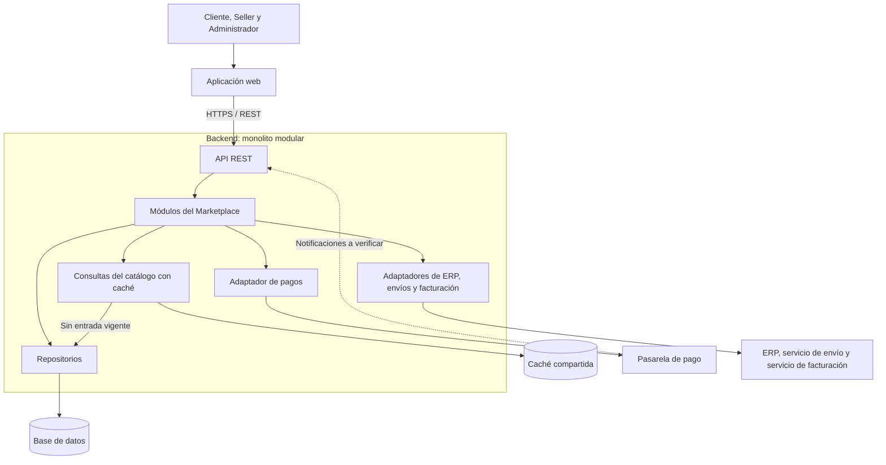

# Estilo arquitectónico del Marketplace

## 1. Estilo seleccionado

Se propone un monolito modular para el backend, con una aplicación
web que se comunica mediante una API REST.

El backend se construirá y desplegará como una aplicación
que contiene módulos con responsabilidades e interfaces definidas.
Sus módulos se comunicarán mediante llamadas internas.

La aplicación web, la base de datos, la caché y los proveedores
externos tendrán funciones diferenciadas dentro de la solución.

La decisión se justifica en
[ADR-001: Monolito modular](decisiones/ADR-001-monolito-modular.md).

## 2. Organización funcional del backend

| Módulo | Responsabilidad |
|---|---|
| Usuarios | Gestionar identidad, autenticación, roles y permisos. |
| Sellers | Gestionar la información de los vendedores y coordinar sus consultas de ventas. |
| Catálogo | Gestionar productos, búsquedas y disponibilidad, incluyendo los productos vinculados al ERP. |
| Carrito | Gestionar los productos seleccionados, sus cantidades y los cálculos previos a la compra. |
| Pedidos | Coordinar la compra y gestionar sus estados de pago, facturación y envío. |
| Pagos | Gestionar los intentos de pago y sus resultados mediante el contrato y el adaptador de la pasarela. |

Cada módulo será responsable de sus operaciones y datos.
La colaboración entre módulos utilizará interfaces definidas,
evitando modificar directamente la información interna de otro.

## 3. Diagrama global propuesto

El bloque de módulos representa Usuarios, Sellers, Catálogo,
Carrito, Pedidos y Pagos.

El bloque externo de ERP, envío y facturación agrupa visualmente
tres sistemas independientes. Cada integración tendrá su
adaptador correspondiente.

Las flechas representan solicitudes o uso de componentes.
Las respuestas se omiten para facilitar la lectura.
Las dependencias del código se detallarán en el documento
del enfoque Clean Architecture.

## 4. Comunicación entre componentes

### Aplicación web y API REST

Los actores realizarán sus operaciones desde la aplicación web.
La API recibirá las solicitudes, comprobará la identidad
y los permisos necesarios y delegará su ejecución.

El backend validará los datos y las condiciones de negocio,
incluyendo la autorización sobre los recursos solicitados.

### Colaboración entre módulos

- Carrito consultará a Catálogo para obtener información
  de los productos y validar las cantidades.
- Pedidos utilizará el contenido del carrito y comprobará
  precios y disponibilidad antes de confirmar la compra.
- Pedidos coordinará con Pagos el inicio y seguimiento del pago.
- Sellers consultará las ventas mediante las operaciones
  autorizadas de Pedidos.
- Usuarios proporcionará las funciones de identidad y permisos;
  cada operación protegida comprobará su autorización.
- Pedidos coordinará facturación y envíos mediante sus adaptadores.

La información de productos y ventas conservará su relación
con el seller correspondiente.

### Acceso a datos y caché

Los repositorios gestionarán el acceso a los datos persistentes.

Las consultas públicas del catálogo podrán reutilizar resultados
temporales mediante la estrategia definida en ADR-003.
Cuando no exista una entrada vigente, se consultará la fuente
persistente y se actualizará la caché.

Las operaciones de compra utilizarán las fuentes y mecanismos
definidos para comprobar precios, publicación y existencias.

### Sistemas externos

| Sistema externo | Función de la integración |
|---|---|
| ERP | Proporcionar información de stock para los productos vinculados, según RC08. |
| Pasarela de pago | Procesar las operaciones de pago y proporcionar resultados verificables. |
| Servicio de facturación | Generar comprobantes y devolver sus referencias. |
| Servicio de envío | Gestionar la información de entrega y sus actualizaciones. |

Las notificaciones externas ingresarán por los endpoints previstos
de la API. Se verificarán mediante el mecanismo correspondiente
al proveedor antes de aplicar cambios de negocio.

## 5. Despliegue y crecimiento

Inicialmente se propone una unidad desplegable para el backend.
Si las pruebas muestran que es necesario, podrán ampliarse
los recursos o ejecutarse varias instancias de esa aplicación
detrás de un balanceador de carga.

Las instancias utilizarán la información persistente compartida
y la caché común. El manejo de sesiones, intentos de pago y
operaciones pendientes deberá funcionar de forma consistente
entre ellas.

La cantidad de instancias y los recursos se definirán mediante
pruebas. Se mantienen las metas propuestas del análisis:

- AC01: con 100 usuarios concurrentes, al menos el 95 % de las
  consultas de productos y operaciones del carrito responderá
  en un máximo de 2 segundos.
- AC03: al pasar de 100 a 200 usuarios concurrentes y ampliar
  recursos o instancias, se buscará mantener el objetivo de AC01.

La capacidad alcanzada dependerá también de la base de datos,
las consultas y los servicios externos.

## 6. Relación con las decisiones arquitectónicas

| Decisión | Aplicación en esta propuesta |
|---|---|
| ADR-001: Monolito modular | Backend desplegable conjuntamente, con módulos delimitados. |
| ADR-002: Clean Architecture | Separación interna de reglas, casos de uso, presentación y detalles técnicos. |
| ADR-003: Estrategia de caché | Reutilización temporal de consultas públicas del catálogo. |
| ADR-004: Integración de pagos | Contrato del núcleo y adaptador para la pasarela externa. |

El monolito modular define la organización global del backend.
Clean Architecture establece cómo se distribuirán sus
responsabilidades y dependencias internas.

## 7. Continuidad y tratamiento de fallos

Las integraciones utilizarán tiempos de espera limitados
y mecanismos de recuperación de operaciones pendientes.

Una interrupción de pagos, facturación o envíos deberá manejarse
sin bloquear innecesariamente la consulta del catálogo.

Los estados de pago, facturación y envío se conservarán
por separado. Un fallo posterior de facturación o envío
mantendrá registrado el resultado del pago confirmado.

Las solicitudes y confirmaciones repetidas deberán controlarse
para evitar cobros y actualizaciones duplicadas.

## 8. Evolución respecto de la arquitectura inicial

La propuesta de la Guía 02 identificó presentación, lógica
de negocio y datos, junto con los componentes de integración.

La Guía 03 precisa esa propuesta mediante límites entre módulos,
decisiones documentadas y reglas de dependencia.

Se mantienen las responsabilidades de Usuarios, Sellers,
Catálogo, Carrito y Pedidos, y se explicita el módulo Pagos.

El documento `arquitectura-inicial.md` se conserva como antecedente
del proceso de diseño.

## 9. Alcance de la propuesta

Este documento describe la arquitectura objetivo del marketplace.

El boilerplate de la docente sirve como referencia ejecutable
para estudiar responsabilidades, contratos y adaptadores.
Su ejecución no constituye la implementación completa
de la arquitectura aquí propuesta.

La elección del lenguaje del backend, motor de base de datos,
tecnología de caché, infraestructura y proveedores deberá
justificarse durante las siguientes etapas.

El cumplimiento de los atributos de calidad deberá comprobarse
sobre la implementación mediante pruebas.