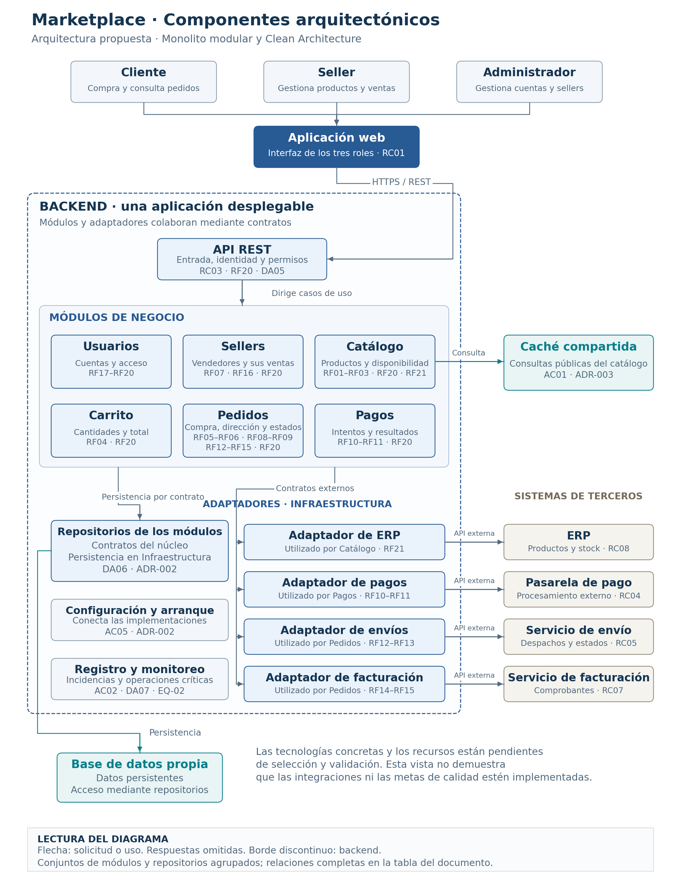

# Componentes arquitectónicos del Marketplace

## 1. Propósito y alcance

Este documento identifica los componentes de la arquitectura propuesta,
sus responsabilidades y su relación con los requisitos funcionales.
Servirá como base para el diagrama de componentes y el diseño interno.

Se mantiene el monolito modular definido en
[ADR-001](decisiones/ADR-001-monolito-modular.md).
El backend se construirá y desplegará como una aplicación cuyos
módulos colaboran mediante interfaces y llamadas internas.

La organización interna seguirá
[ADR-002: Clean Architecture](decisiones/ADR-002-clean-architecture.md),
separando reglas del dominio, casos de uso, presentación y adaptadores
de infraestructura según las responsabilidades de cada módulo.

Los componentes descritos corresponden a la arquitectura objetivo.
El boilerplate de la docente es una referencia ejecutable y no
constituye la implementación completa de esta propuesta.

## 2. Módulos de negocio

| Módulo | Responsabilidad | Requisitos relacionados |
|---|---|---|
| Usuarios | Registrar clientes, gestionar sesiones y cuentas, administrar roles y proporcionar las comprobaciones de identidad y permisos. | RF17, RF18, RF19 y RF20. |
| Sellers | Administrar vendedores y coordinar la consulta de las ventas que corresponden a cada seller, utilizando las operaciones autorizadas de Pedidos. | RF07, RF16 y RF20. |
| Catálogo | Gestionar productos, búsquedas, detalles y disponibilidad. Comprobar la propiedad de los productos gestionados por sellers e incorporar la información de stock del ERP para los productos vinculados. | RF01, RF02, RF03, RF20 y RF21. |
| Carrito | Gestionar los productos seleccionados, sus cantidades y el cálculo del total. Consultar a Catálogo para comprobar los productos y su disponibilidad. | RF04 y RF20. |
| Pedidos | Generar y consultar pedidos, registrar la dirección de entrega y coordinar los estados de pago, envío y facturación. | RF05, RF06, RF08, RF09, RF12, RF13, RF14, RF15 y RF20. |
| Pagos | Gestionar las solicitudes de pago y registrar los resultados verificados de la pasarela, comunicándolos a Pedidos. | RF10, RF11 y RF20. |

### Responsabilidades compartidas

- Usuarios proporciona las funciones de identidad y permisos.
  Cada operación protegida debe verificar el acceso sobre los datos
  concretos que solicita o modifica.
- Cada módulo mantiene el control sobre sus datos. Los demás módulos
  colaboran mediante sus interfaces y no modifican directamente
  su información interna.
- Pedidos conserva por separado los estados de pago, envío y
  facturación. Pagos conserva los intentos y resultados de pago.
- El backend calcula y valida precios, cantidades y totales antes
  de registrar un pedido, según las reglas del análisis funcional.
- Los módulos se despliegan conjuntamente como parte del monolito.
  Su separación interna facilita mantener responsabilidades claras.

  ## 3. Componentes técnicos e infraestructura

| Elemento | Responsabilidad | Origen de la necesidad |
|---|---|---|
| Aplicación web | Presentar las funciones para clientes, sellers y administradores y solicitar las operaciones mediante la API. | RC01 y RC03. |
| API REST | Recibir solicitudes, validar su estructura, comprobar identidad y permisos y dirigir cada operación al caso de uso correspondiente. | RC03, RF20 y DA05. |
| Repositorios | Implementar los contratos de persistencia de cada módulo, manteniendo los detalles de acceso a datos fuera de las reglas de negocio. | DA06 y ADR-002. |
| Base de datos propia | Conservar cuentas, vendedores, productos, carritos, pedidos, intentos de pago y referencias de envíos y comprobantes. Cada módulo controla su información mediante sus repositorios. | RF03, RF05, RF11, RF15 y RF17, entre otros. |
| Caché compartida del catálogo | Reutilizar temporalmente consultas públicas de productos, aplicando la vigencia e invalidación definidas en ADR-003. | AC01, DA02 y ADR-003. |
| Configuración y arranque | Conectar los casos de uso con los repositorios y adaptadores seleccionados para el entorno de ejecución. | AC05 y ADR-002. |
| Registro de incidencias y monitoreo | Registrar fallos y observar las operaciones críticas para evaluar su disponibilidad y facilitar la recuperación. | AC02, DA07 y EQ-02. |

La aplicación web, la base de datos y la caché se representarán
como elementos diferenciados del backend. La API, los repositorios
y los adaptadores forman parte de su implementación interna.

### Condiciones de uso

- La aplicación web accede a las funciones mediante la API;
  el acceso a la base de datos se realiza desde el backend.
- Las comprobaciones de permisos deben aplicarse también sobre
  los datos concretos de cada operación protegida.
- La caché se utiliza para las consultas públicas previstas.
  La confirmación de compra debe verificar precios, publicación
  y existencias mediante las fuentes autorizadas.
- La configuración selecciona las implementaciones concretas,
  respetando los contratos del núcleo.
- Los registros de incidencias deben permitir investigar fallos
  sin incluir contraseñas, credenciales secretas ni datos completos
  de tarjetas.
- El lenguaje y framework del backend, el motor de base de datos
  y la tecnología de caché siguen pendientes de selección
  y justificación.

## 4. Componentes de integración y sistemas externos

Los adaptadores pertenecen a Infraestructura. Implementan los contratos
que necesita el núcleo y concentran la comunicación, autenticación
técnica y transformación de datos de cada proveedor.

| Adaptador | Módulo que lo utiliza | Sistema externo y función | Requisitos y restricciones |
|---|---|---|---|
| Adaptador de ERP | Catálogo. | Consulta productos y stock del ERP y transforma su información al formato interno de los productos vinculados. | RF21 y RC08. |
| Adaptador de pagos | Pagos. | Envía las solicitudes a la pasarela y obtiene resultados verificables para gestionar el estado del pago. | RF10, RF11, RC04 y RC09. |
| Adaptador de envíos | Pedidos. | Envía la información necesaria para el despacho y recibe o consulta las actualizaciones del servicio de envío. | RF12, RF13 y RC05. |
| Adaptador de facturación | Pedidos. | Solicita el comprobante de una compra con pago aprobado y obtiene su referencia para asociarla al pedido. | RF14, RF15 y RC07. |

### Condiciones de integración

- Los adaptadores se ejecutan dentro del backend del monolito modular.
- El núcleo utiliza sus contratos; los detalles de cada proveedor
  se mantienen en el adaptador correspondiente.
- Si un proveedor utiliza notificaciones, estas ingresan mediante
  los endpoints previstos de la API y deben verificarse antes
  de aplicar cambios de negocio.
- Un pago se considera aprobado únicamente cuando existe una
  confirmación válida de la pasarela. Un tiempo de espera agotado
  no debe interpretarse como aprobación ni como rechazo definitivo.
- El despacho requiere pago aprobado y productos preparados.
  La facturación se solicita para compras con pago aprobado.
- Para los productos vinculados al ERP, se respeta ese sistema
  como fuente de información de stock.
- Las solicitudes y confirmaciones repetidas deben controlarse
  para evitar cobros, despachos o comprobantes duplicados.
- Los proveedores, formatos, credenciales, tiempos de espera
  y procedimientos de recuperación deberán precisarse al implementar
  y probar cada integración.

## 5. Relaciones entre componentes

| Origen | Destino | Relación |
|---|---|---|
| Cliente, Seller y Administrador | Aplicación web | Utilizan las funciones disponibles según su identidad y permisos. |
| Aplicación web | API REST | Envía solicitudes y recibe resultados mediante HTTPS. |
| API REST | Usuarios y casos de uso de los módulos | Comprueba identidad y permisos y dirige cada solicitud a la operación correspondiente. |
| Carrito | Catálogo | Consulta productos, precios y disponibilidad para gestionar sus elementos. |
| Pedidos | Carrito y Catálogo | Obtiene la selección y valida precios, cantidades y existencias antes de registrar la compra. |
| Sellers | Pedidos | Consulta la información de ventas limitada al vendedor autorizado. |
| Pedidos | Pagos | Solicita iniciar o consultar un pago y utiliza su resultado verificado para gestionar el pedido. |
| Catálogo | Adaptador de ERP | Obtiene información de productos y stock de los registros vinculados al ERP. |
| Pagos | Adaptador de pagos | Inicia y consulta operaciones en la pasarela mediante el contrato definido. |
| Pedidos | Adaptadores de envíos y facturación | Coordina el despacho y la generación de comprobantes cuando se cumplen sus condiciones. |
| Casos de uso de cada módulo | Repositorios de su módulo | Consultan y guardan información mediante los contratos del núcleo. |
| Repositorios | Base de datos propia | Implementan las operaciones de persistencia. |
| Consultas públicas de Catálogo | Caché compartida | Reutilizan resultados vigentes; cuando no existe una entrada vigente, consultan los datos persistentes. |
| Configuración y arranque | Casos de uso, repositorios y adaptadores | Conecta los contratos con las implementaciones elegidas. |
| Registro y monitoreo | API, módulos e integraciones | Observa las operaciones y recoge incidencias para evaluar disponibilidad y recuperación. |

Estas relaciones describen la colaboración durante la ejecución.
Las dependencias del código se dirigen hacia el núcleo, según
ADR-002: un caso de uso utiliza un contrato y recibe un adaptador
que lo implementa, sin importar la implementación concreta.

Las notificaciones externas, cuando existan, ingresan por la API.
El componente de integración verifica su origen y contenido antes
de que el caso de uso aplique el resultado a los datos del módulo.

## 6. Diagrama de componentes

El borde del backend delimita la aplicación del monolito modular.
Los seis módulos y los componentes de integración se despliegan
conjuntamente. La aplicación web, la base de datos, la caché
y los sistemas de terceros se muestran fuera de ese borde.

Las flechas indican solicitudes o uso de componentes durante
la ejecución; las respuestas se omiten. Las flechas hacia el conjunto
de módulos agrupan las relaciones detalladas en la sección 5.

Los repositorios también se agrupan visualmente: cada módulo
mantiene sus propios contratos y componentes de persistencia.

La configuración y el monitoreo aparecen como funciones de soporte
del backend. Sus relaciones se detallan en la tabla anterior.

La imagen muestra la arquitectura propuesta. Las tecnologías
concretas y la capacidad de la infraestructura deberán justificarse
y validarse durante la implementación.
