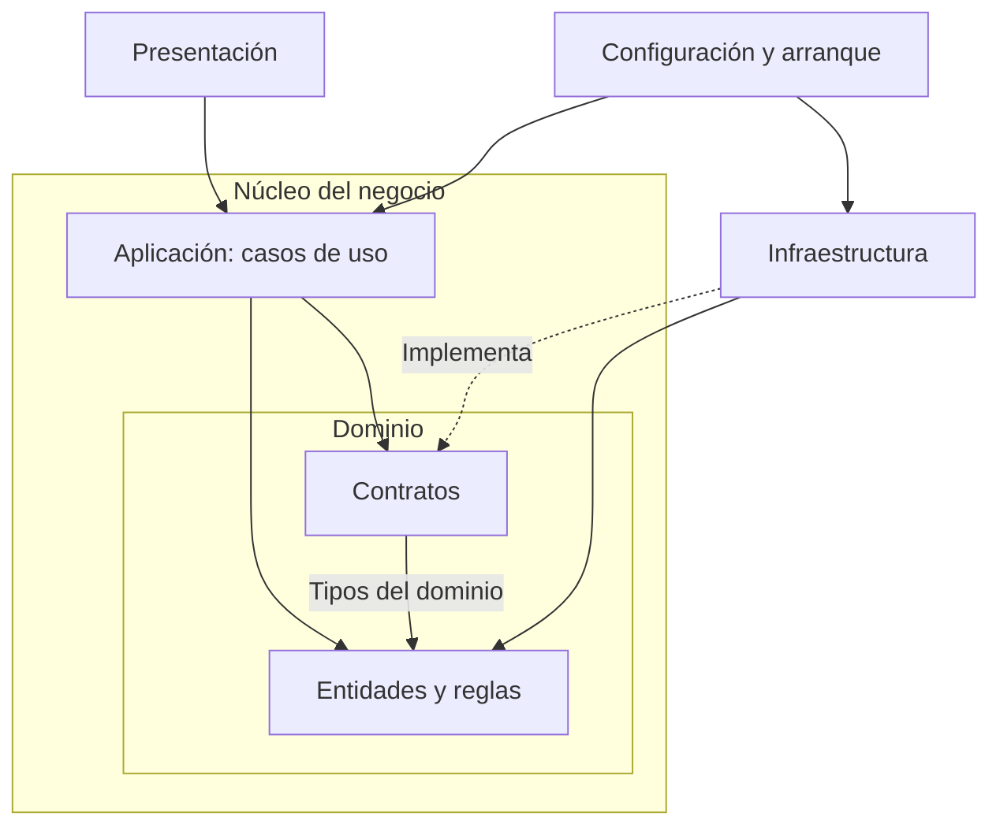

# Enfoque arquitectónico: Clean Architecture

## 1. Enfoque seleccionado

Se aplicará Clean Architecture para organizar las responsabilidades
y controlar las dependencias internas del marketplace.

El objetivo es mantener las reglas del negocio independientes
de los detalles de interfaz, almacenamiento y servicios externos.

Esta propuesta responde a DA06 — Mantenibilidad y evolución modular,
y desarrolla la decisión registrada en
[ADR-002: Clean Architecture](../decisiones/ADR-002-clean-architecture.md).

El monolito modular define la organización global del backend.
Clean Architecture orienta la estructura interna de sus módulos.

## 2. Partes y responsabilidades

| Parte | Responsabilidad | Aplicación en el marketplace |
|---|---|---|
| Dominio | Definir entidades, reglas fundamentales y contratos del núcleo. | Producto, Carrito, Pedido, reglas de existencias y cálculo de precios. |
| Aplicación | Coordinar los casos de uso mediante las entidades y los contratos. | Consultar catálogo, agregar productos al carrito y registrar una compra. |
| Infraestructura | Implementar los contratos que requieren tecnologías o servicios externos. | Repositorios, caché y adaptadores de ERP, pagos, facturación y envíos. |
| Presentación | Recibir las solicitudes, transformar sus datos y presentar resultados. | Componentes web y controladores de entrada de la API. |

Para seguir la organización del ejemplo, los contratos de repositorios
y proveedores se ubicarán en el núcleo, dentro de Dominio.

Las partes se distinguirán dentro de los módulos según sus necesidades.
Las entidades y operaciones conservarán un módulo responsable,
evitando que cualquier módulo modifique sus datos directamente.

## 3. Diagrama de dependencias

Una flecha continua indica que el código de origen utiliza elementos
definidos en el destino. La flecha discontinua indica que un adaptador
implementa un contrato del núcleo.

El diagrama resume las dependencias principales del código.
La relación entre contratos y entidades corresponde, por ejemplo,
a un repositorio cuyo contrato recibe o devuelve productos.

La configuración conecta los casos de uso con los adaptadores.
La elección de una implementación concreta se realiza en ese punto.

## 4. Regla de dependencia

El dominio mantendrá sus entidades y reglas sin importar
componentes de Angular, clientes HTTP o implementaciones
de acceso a datos.

Los casos de uso utilizarán entidades y contratos del núcleo.
Recibirán las dependencias necesarias mediante sus constructores
u otro mecanismo de inyección definido para la implementación.

Los adaptadores dependerán de los contratos que implementan.
Sus tareas incluirán transformar datos, comunicarse con proveedores
y traducir sus respuestas al formato interno.

La presentación delegará las operaciones a los casos de uso.
Las reglas de precios, existencias y estados se mantendrán
en el núcleo correspondiente.

## 5. Dependencias y ejecución de una operación

Durante la ejecución, un caso de uso puede solicitar una operación
a un adaptador. Esto es posible porque recibe un objeto que cumple
el contrato definido en el núcleo.

Por ejemplo:

1. El caso de uso solicita procesar un pago mediante su contrato.
2. La implementación configurada realiza la operación.
3. El adaptador devuelve un resultado con el formato esperado.
4. El caso de uso continúa según ese resultado.

El caso de uso conoce las operaciones del contrato.
El adaptador conoce los detalles del proveedor.

Por ello, la dirección de una llamada durante la ejecución
puede ser distinta de la dirección de las dependencias del código.

## 6. Evidencias del boilerplate

El proyecto de referencia organiza el código dentro de
`tecnologia/boilerplate-clean-arquitecture/src/app/`.

| Ubicación | Evidencia observada |
|---|---|
| `dominio/modelos/producto.modelo.ts` | Contiene reglas relacionadas con el producto y sus existencias. |
| `dominio/modelos/carrito.modelo.ts` | Gestiona los elementos del carrito y utiliza las reglas de precios. |
| `dominio/modelos/precios.ts` | Contiene funciones para los cálculos de precios, comisión e IGV del ejemplo. |
| `dominio/modelos/pedido.modelo.ts` | Define el pedido y sus reglas de estado. |
| `dominio/contratos/` | Define interfaces de repositorios, pagos y notificaciones. |
| `aplicacion/` | Contiene los casos de uso de catálogo, carrito y compra. |
| `infraestructura/` | Contiene las implementaciones de los contratos. |
| `presentacion/` | Contiene los componentes visuales y el estado del carrito. |
| `app.config.ts` | Selecciona los adaptadores y los entrega a los casos de uso. |

### Ejemplo de inversión de dependencias

`RegistrarCompraCasoUso` recibe el contrato `ProcesadorPagos`
mediante su constructor.

La configuración utiliza `ProcesadorPagosSimulado` como
implementación de ese contrato.

Así, el caso de uso puede ejecutarse durante las pruebas utilizando
un procesador simulado. Los detalles de una pasarela concreta
pertenecen a su adaptador.

El cambio de proveedor requerirá implementar el contrato,
ajustar la configuración y verificar la integración.
Si las capacidades necesarias cambian, también deberá revisarse
el contrato.

## 7. Aplicación al sistema completo

El boilerplate demuestra este enfoque dentro de una aplicación
Angular. En la solución completa, la aplicación web se comunicará
con el backend mediante la API REST.

El backend aplicará sus propias verificaciones de identidad,
autorización, precios, disponibilidad y estados de las operaciones.

La organización propuesta permitirá:

- Mantener las reglas de productos y existencias en Catálogo.
- Encapsular las reglas del carrito en su módulo.
- Coordinar la compra y sus estados desde Pedidos.
- Gestionar pagos mediante contratos y adaptadores.
- Conservar las responsabilidades de Usuarios y Sellers.
- Concentrar las integraciones externas en Infraestructura.

La caché definida en ADR-003 se aplicará a las consultas públicas
previstas, conservando las comprobaciones necesarias para comprar.

La integración de pagos seguirá ADR-004, incluyendo resultados
pendientes, confirmaciones verificadas y control de duplicados.

## 8. Beneficios y compromisos

La separación facilita probar reglas y casos de uso sin iniciar
la interfaz ni conectarse a proveedores reales.

También permite concentrar los cambios técnicos en los adaptadores
cuando los contratos y las necesidades del negocio se mantienen.

Como compromiso, deberán mantenerse interfaces, transformaciones
de datos y pruebas de integración. La organización en carpetas
deberá reflejar responsabilidades y dependencias reales.

## 9. Verificación realizada y pendiente

En el proyecto de referencia se ejecutó `npm run pruebas`.
Las 16 pruebas incluidas finalizaron correctamente sin iniciar
Angular ni un navegador.

También se comprobó la apertura del catálogo en la aplicación web.

La revisión del código de Dominio y Aplicación mostró que sus
importaciones se mantienen dentro del núcleo, sin depender
de Angular ni de adaptadores concretos.

Para el sistema completo quedará pendiente verificar:

- Las dependencias entre los módulos y sus partes internas.
- Las reglas y casos de uso con pruebas automatizadas.
- El cumplimiento de los contratos por cada adaptador.
- La integración con la API y los proveedores seleccionados.
- Los atributos de calidad sobre la infraestructura utilizada.

Estos resultados del ejemplo sirven como evidencia de aprendizaje.
La implementación completa del marketplace corresponde
a las siguientes etapas del proyecto.